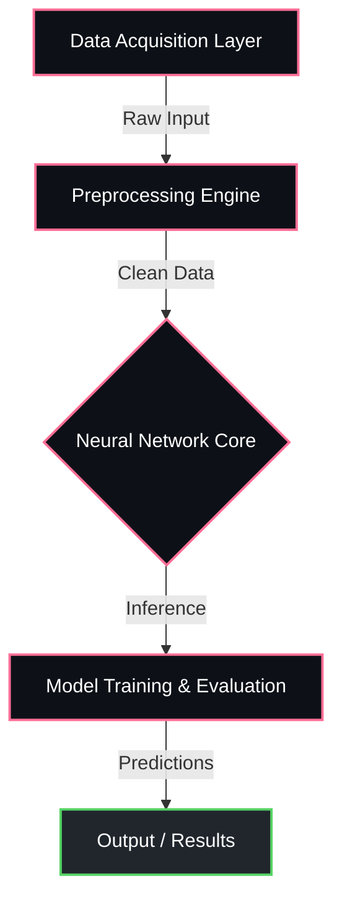

<div align="center">


<p align="center">
  
  
  
  
</p>


</div>

---

## Overview

> Explainable AI framework for visualizing deep learning decisions.

**NeuroXAI** is a proprietary machine learning / ai system engineered by **Karthik Idikuda**. 

<br/>

## System Architecture



<br/>

## Project Structure

```
NeuroXAI/
  .DS_Store
  LICENSE
  NeuroXAI-The-Glass-Box-Future-of-Neuro-Diagnosis.pdf
  NeuroXAI_Colab_Advanced.ipynb
  README.md
```

<br/>

## Technical Specifications

| Attribute | Detail |
|:---|:---|
| **Primary Language** | `Jupyter Notebook` |
| **Project Category** | `Machine Learning / AI` |
| **Total Source Files** | `5` |
| **Frameworks** | `Native` |
| **Intellectual Property** | `Strictly Proprietary` |

<br/>

## STRICT LEGAL WARNING & LICENSE

> **PROPRIETARY AND CONFIDENTIAL**

This software and all associated documentation are the **exclusive property of Karthik Idikuda**.

- **NO PERMISSION IS GRANTED** to use, copy, modify, merge, publish, distribute, sublicense, or sell copies of this software without explicit, written consent from the author.
- **UNAUTHORIZED USE WILL RESULT IN SEVERE LEGAL ACTION.** Any individual or organization found using, referencing, or deploying this code without paying the required licensing fees will face immediate litigation, financial penalties, and potentially criminal prosecution where applicable by law.
- **TO OBTAIN A LEGAL LICENSE**, you must directly contact Karthik Idikuda to negotiate payment terms.

*By accessing this repository, you acknowledge and accept these strict proprietary terms.*

---

<div align="center">
  
</div>

<!-- TRACKING: S0ktTmV1cm9YQUktVFJBQ0s= -->
